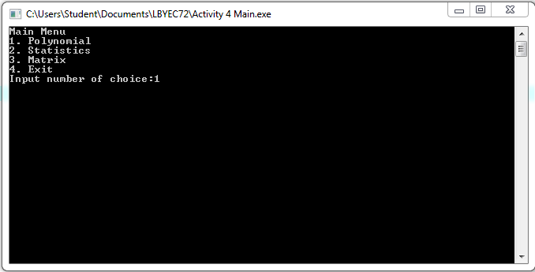
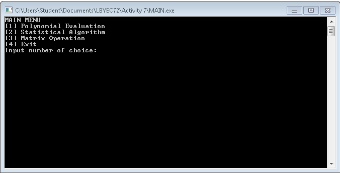
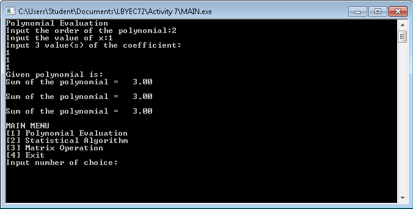
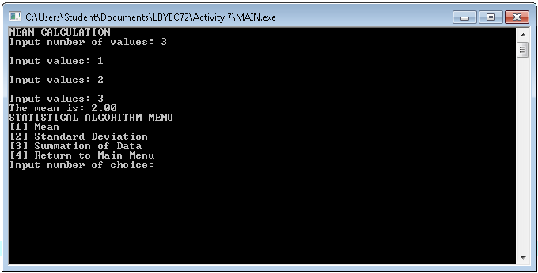
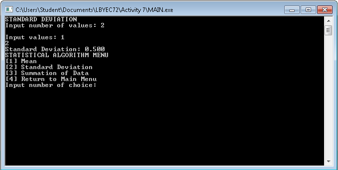
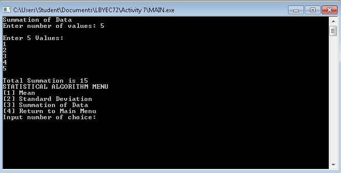
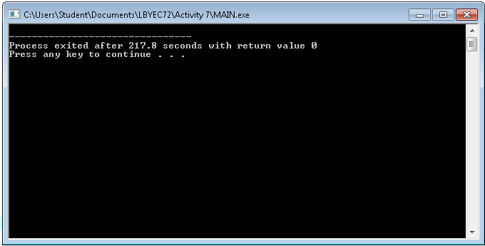

# lbyec72-ej1-p3-single_multidimensional_arrays-daniellegailtan
lbyec72-ej1-p3-single_multidimensional_arrays-daniellegailtan created by GitHub Classroom

Done with Polynomial

Exit

Polynomial

Returns back to Main Menu

FOR PASS BY ACTIVTY

Not done with Matrix Operations!!!!

